# Super Cars

## Site Overview
Super Cars is a leading luxurious car dealer selling premium Lamborghini and Bugatti luxurious cars. The website intends to target people who are interested in buying high speed top brand luxurious cars. The site offeres exclusive information about the company and a range of cars available to attract site visitors to purchase their dream car.

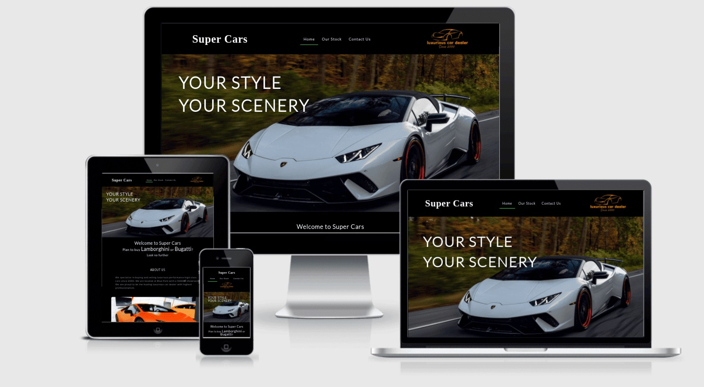

Click here to view the site - [Super Cars live website](https://veronicalourens.github.io/supercars/)

## Design / Existing Features
The website is created based on the initial design on the large desktop size. Then add the media queries to make it responsive on different media screen sizes from 320px up to 2300px. All of pages are re-sized accordingly.

### Navigation Header

  * All three pages have the same logo and nativation menu on the top of the website. Logo "Super Cars" on the left, navigation links "Home, Our Stock and Contact" in the middle and the a graphic logo on the right.

  * The navigation header clearly shows the user where to find the relevant information around the website. 
  
  

### Home Page
It contains a hero image, descriptions “About Us” and “Our Missions”, following with a services commitments section “Our Commitments” to emphasis Super Cars company’s unique business scope and quality excellent service. This is very inviting and much enthusiasm with promises to gain the trust from the users coming forward to purchase luxurious cars.
* Hero Section

* About Us and Our Missions

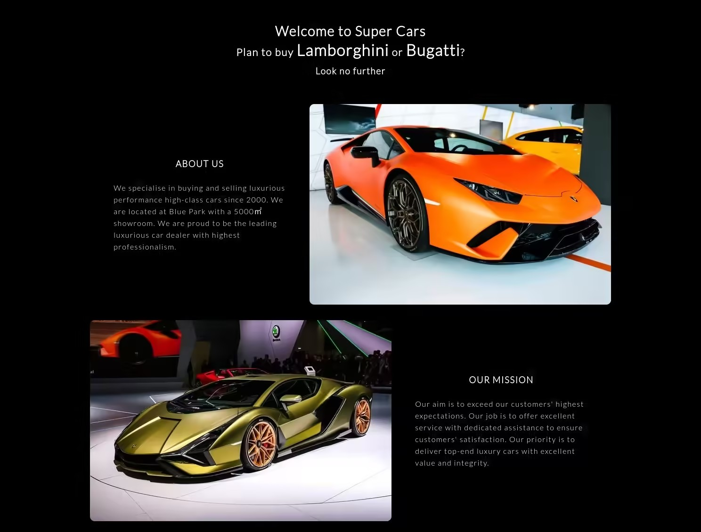

* Our Commitments

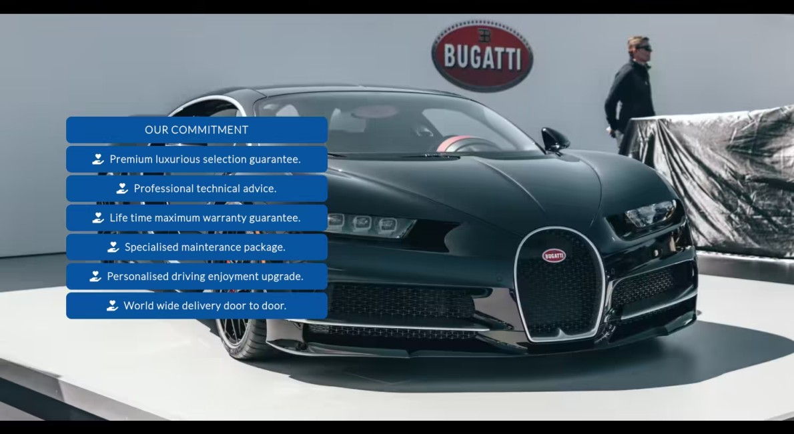

### Footer
All three pages have the same footer at the bottom of the website that includes contact details, business hours info, social media links, copyright text and disclaimer.

### Our Stock Page
The page contains a brief description about the characters of Lamborghini Sian and Bugatti Chiron. There is a photo gallery with a huge collection of different model luxurious cars available in the Super Cars showroom. 

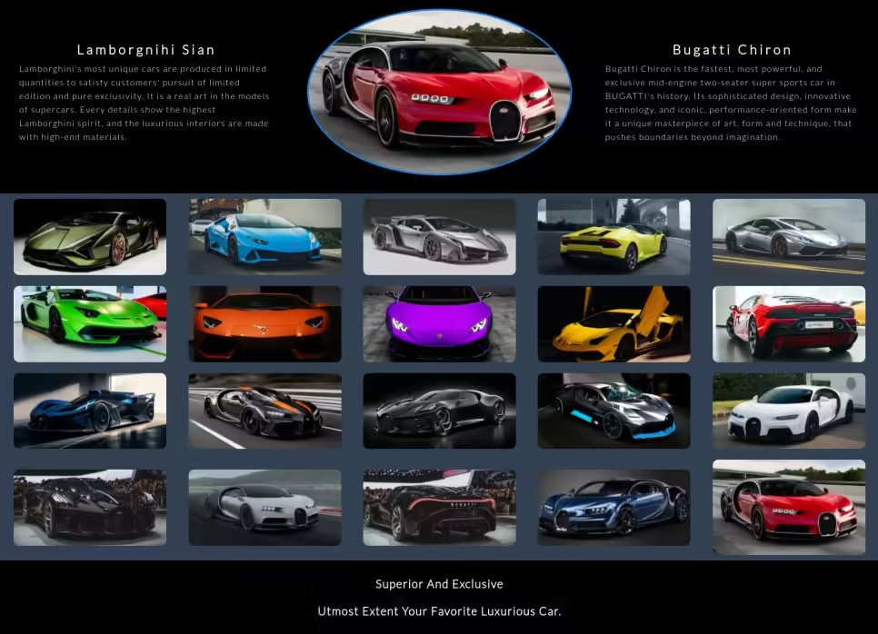

### Contact Page
The page contains an image and a description, a contact form with a selection list of cars for user to choose when making contact and send their interests and messages to Super Cars company. Users can easily contact or visit Super Cars company to view or test drive.

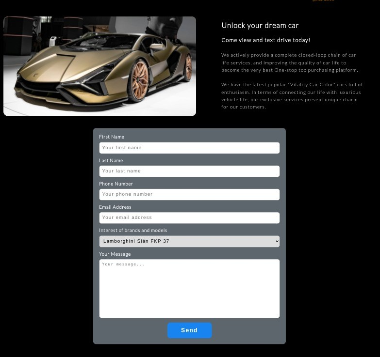

## Planning Stage
Made a few sketches on the paper to put my ideas on display. Looked for some information about the Lamborghini and Bugatti cars online.

### Initial Sketches

* Home Page 

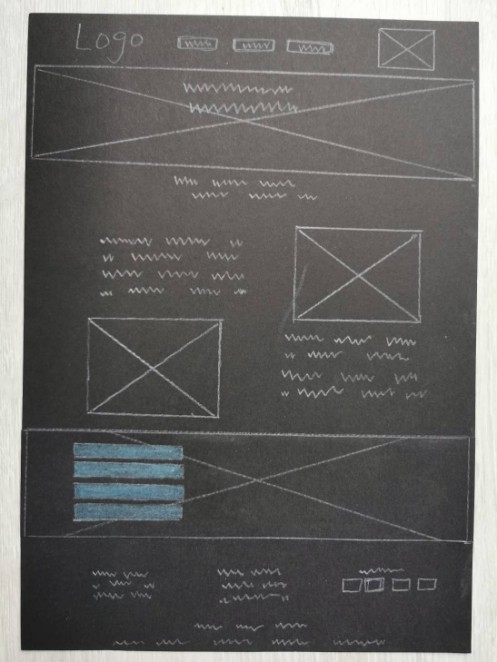

* Our Stock Page

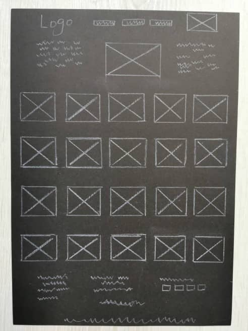

* Contact Page

### User Story
* As a first time user, I want the website to be easily accessible on different devices and work on different browsers.

* As a first time user, I want to easily navigate around the page for getting to know what the site is about.

* As a returning user, the name of website should be easy to type and remember. The images need to be high quality and the text should be easy to read.

* As a returning user, I want the car dealer's website not only provide a collection of cars but also information about the range of services available for further visiting.

* As a frequent user, I want to know more about cars' design and other features. I also want to know what service packages are offered when buying cars.

* As a frequent user, I want to know the contact details of Super cars company for viewing and test drive.

### Site Owner Story
* To target the luxurious car buyers, the website must be responsive on different media screen sizes.

* The site shoud have a great collection of high quality photos of premiium cars with different nodels to attact site users to return.

* The content on the website should be easy to load and offer an easy way to navigate around the site where users can easily find a huge range of cars.

* The site uses top quality photos and short description to present the simple yet attactive inviting messages.

* The site offers many different contact methods for user to make contact in their preferable contact ways such as phone, email, web-form and other social media platforms.

### Color Schemes
I used *Adobe Color* and *EightShapes Contrast* to determine the primary color for the background and text on the website. I select the black background for the website and white color for the text. 

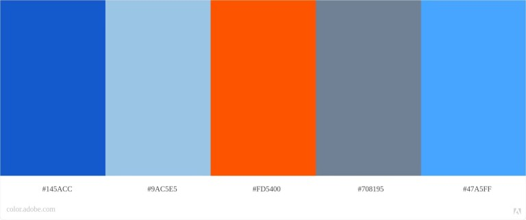

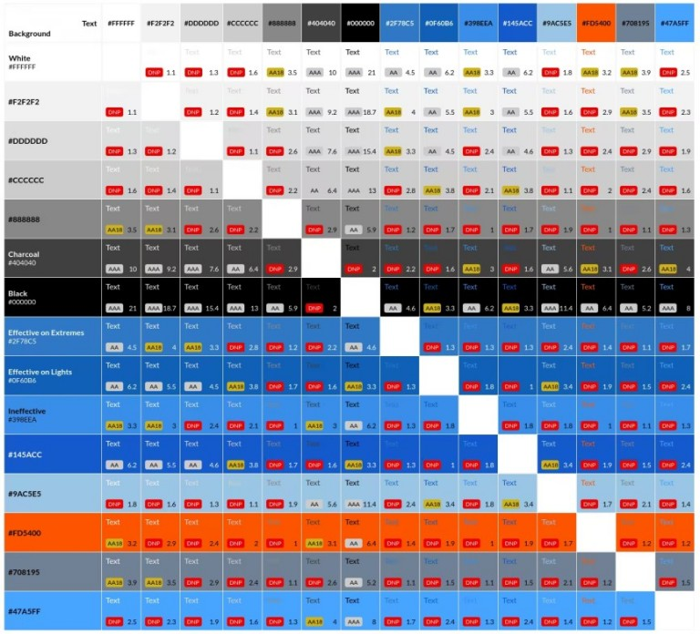

## Deployment
On the GitHub page, I go to the supercars repository,then go to the tab of "settings", scroll down to the "Github Page" section, then select branch "main" and click "save" under the heading "source". The site is published soon after with a link. 

## Testing

### Lighthouse Testing

I tested the website on Chrome Incognito window using Lighthouse on dev tools for both mobile and desktop. The final result shows here after taking the improvement steps. 

* Desktop

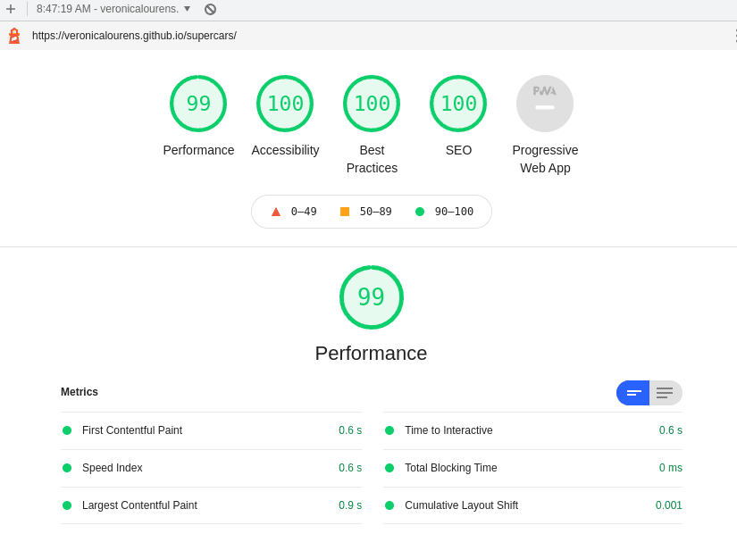

* Mobile

* Performance Scores

  * The initial score was 73% on the home page, 87% on the gallery page and 92% on the contact page due to the render-blocking resources found such as cumulative layout shift, largest contentful paint, large size of images, large size of css file and images were not set an explicit width and height.

  * To improve the performance score

    I used the online free image compression tools to compress all the images in the image folder. First I converted the png format to avif format but it didn’t work well so that I converted the images to jpg format and replaced all images on three pages with compressed jpg images. I also created a new media css file and placed the media query css code to a separate media css file. Deleted  empty spaces both on html and css file. 

* Accessibility Score

  * The initial accessibility score was between 92% - 96% due to the background and foreground contrast ratio issues. The font size was set to less than 12px.  The heading element on the gallery page was not in sequentially descending order. 

  * To improve the accessibility score

    I changed the background color of “commitment list” on the home page to darker blue background for better contrast with the text color.  Increased the font-size on the media query styling to ensure the readability on small screens. I added an extra-text div with a h3 heading to the gallery page in order to make the headings in a good order. Adjusted the header element to avoid the elements overlapping on small screens. 

* Best Practices Score

  * The initial score was 98%. There was no major issues. The score went up to 100% during improvements made on other parts of testing.

* SEO Score

  * SEO was initially 97% on all three pages due to the links weren’t working well. I corrected the typo on the  html file footer element for the social media links “noopenner” to “noopener”.

### Testing on screens
I tested that the website is fully responsive on desktop, laptop, iPad and mobile phone. Initially, it worked well on the desktop, laptop and iPad. However, it only displayed the top parts of the site on my phone due to the site couldn't be scrolled down to see the rest of the site. I assumed that the rest of the site was blocked for whatever reason. It did work on landscape mode on my phone when I turned my phone sideways. With tutor’s help, it worked out well in the end.

### Testing on the browsers
I have tested that the Super Cars website is accessible on different browsers. It works well on Google Chrome, Microsoft Edge, Safari and Mozilla Firefox. The website is fully responsive on devices with different screen sizes while using different browsers. The Super Cars website loads fast on different browers.

### Code Validation

* Initial Result

  All the code for the website are validated on the W3C HTML markup validation and CSS validation by entering the Super Cars' URL. 

  * W3C HTML Validation - Two errors and one warning found.

  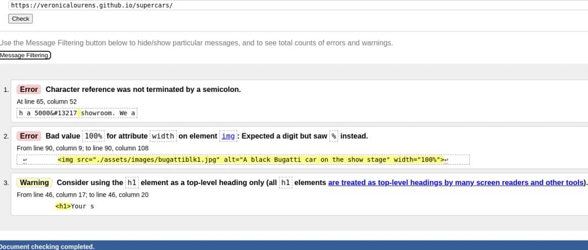

  * W3C CSS Validation - No errors found.

  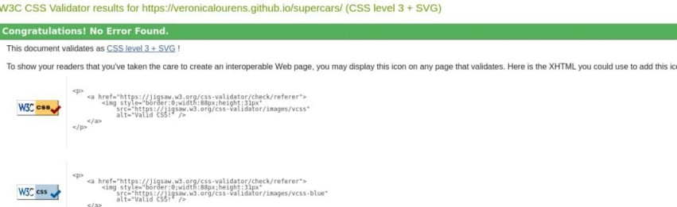

* Final Result

  After updateing the HTML and CSS code to fix the issues. No errors were found on all of the three pages.

  * Home Page

      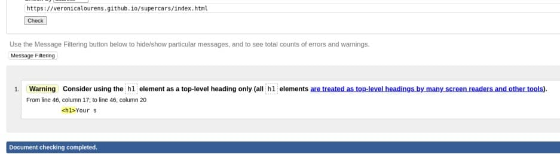

  * Our Stock Page

      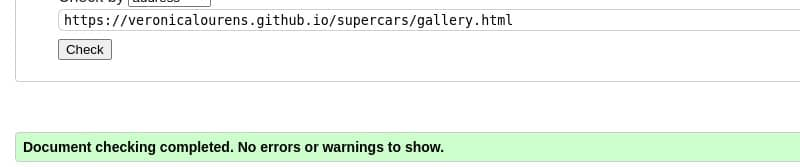

  * Contact Page

      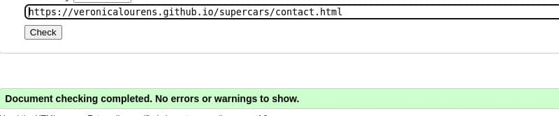

## Technoligies Used

* HTML5 - for creating Super Cars website structure with text and images.

* CSS - for styling the website content.

## Tools Used

* GitHub - host and deploy the website with its content.

* GitPod - for editing the code and pushing the code to GitHub.

* Font Awesome - provides the icons used on the website.

* Google Fonts - provides the fonts for the website.

* W3C Markup Validatior - validate website's HTML code.

* W3C CSS Jigsaw Validatior - validate website's CSS code.

* Chrome Dev Tools - test the code and site responsiveness.

* Adobe Color - extract the site's color theme.

* EightShape Contrast - auto-make color contrast grid.

* Squoosh & Compressor - compress and convert the site's images.

* Amiresponsive - generate site's responsiveness on different screens.

* Slack - get support for the course and the project.

* Unsplash - download all the images.

* Google.com - provide certain text content.

* Stack Overflow - provide extra support information.

* W3C School - extra learning materials.

## Limitation and Unfixed Bug

* The contact details on the page such as address, phone number and email address cannot be actually used due to they are created only for display purpose with no actual functions.

* The contact form on the Contact page cannot be stored any data and sent actual messages because there is no actual functionality of the form. The form attributes are deleted in HTML file to avoid any error.

* There is a known and unfixed bug on the home page index.html at line 46. I understood that h1 heading should be used in the future projects.

