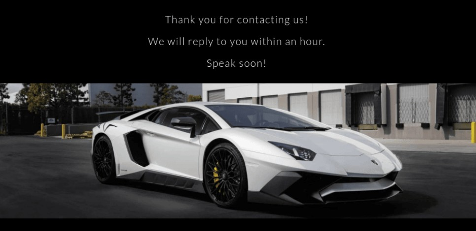
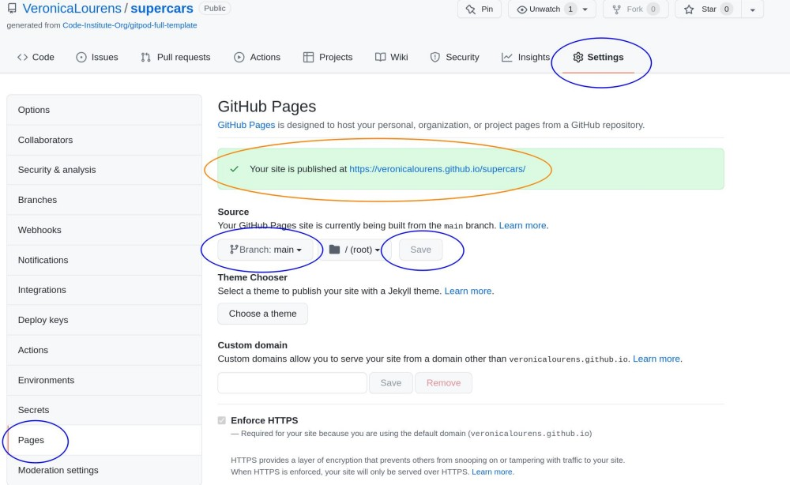

# Super Cars

## Site Overview
Super Cars is a leading luxurious car dealer specialised in selling premium Lamborghini and Bugatti luxurious cars. The website intends to target people who are interested in buying high speed top brand luxurious cars. The site offeres exclusive information about the company and a range of cars available to attract site visitors to purchase the luxurious car.

Click here to view the live website - [Super Cars](https://veronicalourens.github.io/supercars/)

# Content

  - [User Experience UX](#user-experience-ux)
    - [User Stories](#user-stories)
    - [Site Owner Stories](#site-owner-stories)
    - [Sketches on Paper](#sketches-on-paper)
    - [Design Choice](#design-choice)
  - [Existing Features](#existing-features)
    - [Navigation Header](#navigation-header)
    - [Home Page](#home-page)
    - [Footer](#footer)
    - [Our Stock Page](#our-stock-page)
    - [Contact Page](#contact-page)
    - [Future Features](#future-features)
  - [Technologies Used](#technologies-used)
  - [Testing](#testing)
    - [Code Validation](#code-validation)
    - [Lighthouse Testing](#lighthouse-testing)
    - [Testing Responsiveness](#testing-responsiveness)
    - [Testing on the browsers](#testing-on-the-browsers)
    - [Known Bugs](#known-bugs)
    - [Limitation](#limitation)
  - [Deployment](#deployment)
    - [Site deployment](#site-deployment)
    - [clone the project](#clone-the-project)
  - [Credit](#credit)
  - [Acknowledgement](#acknowledgement)

## User Experience UX

### User Stories
* As a first time user, I want the website to be easily accessible on different devices and work on different browsers.

* As a first time user, I want to easily navigate around the page for getting to know what the site is about.

* As a returning user, the name of website should be easy to type and remember. The images need to be high quality and the text should be easy to read.

* As a returning user, I want the car dealer's website not only provide a collection of cars but also information about the range of services available for further visiting.

* As a frequent user, I want to know more about cars' design and other features. I also want to know what service packages are offered when buying cars.

* As a frequent user, I want to know the contact details of Super cars company for viewing and test drive.

### Site Owner Stories
* To target the luxurious car buyers, the website must be responsive on different media screen sizes.

* The site shoud have a great collection of high quality photos of premiium cars with different nodels to attact site users to return.

* The content on the website should be easy to load and offer an easy way to navigate around the site where users can easily find a huge range of cars.

* The site uses top quality photos and short description to present the simple yet attactive inviting messages.

* The site offers many different contact methods for user to make contact in their preferable contact ways such as phone, email, web-form and other social media platforms.

[Back to Top](#super-cars)

### Sketches on Paper
The drawings of the website are for the device with large desktop and laptop screens.

* Home Page 

  

* Our Stock Page

  

* Contact Page

  

[Back to Top](#super-cars)

### Design Choice

* Color Scheme
  
    I used **Adobe Colors** and **EightShapes Contrast** to determine the primary color for the background and the text on the website. I select the black background for the website and white color for the text for the maximum contrasts with the screenshots chosen.  

    

    

* Typography

  The fonts chosen on the website are Lato for the body text that it's easy to read. The fall back fonts are "Open Sans" and sans-serif. The font used for the logo is fantasy chosed on the option list that provides a great contrast to the page text.

[Back to Top](#super-cars)

## Existing Features

The website contians four pages. All of pages are responsive accordingly on different media screen sizes from 320px up to 3000px.

### Navigation Header

  * All of four pages have the same logo and nativation menu on the top of the website. Logo "Super Cars" on the left, navigation links "Home, Our Stock and Contact" in the middle and the a graphic logo on the right.

  * The navigation header clearly shows the user where to find the relevant information around the website. 
  
  

### Home Page
  It contains a hero image with two short lines of text, descriptions “About Us” and “Our Mission”, following with a services commitment section “Our Commitment” to emphasis Super Cars company’s unique business scope and quality excellent service. This is very inviting and much enthusiasm with promises to gain the trust from the users coming forward to purchase luxurious cars.

* Hero Section

* About Us and Our Mission

[Back to Top](#super-cars)

* Our Commitment

[Back to Top](#super-cars)

### Footer
All of four pages have the same footer at the bottom of the website that includes contact details, business hours info, social media links, copyright text and disclaimer.

### Our Stock Page
The page contains a brief description about the characters of Lamborghini Sian and Bugatti Chiron. There is a photo gallery with a huge collection of different model luxurious cars available in the Super Cars showroom. 

[Back to Top](#super-cars)

### Contact Page
The page contains an image and a description, a contact form with a selection list of cars for user to choose when making contact and send their interests and messages to Super Cars company. Users can easily contact or visit Super Cars company to view or test drive.

[Back to Top](#super-cars)

### Form-feedback Page
The page contains an image and a short thank you message after user send the message on the "Contact form". Letting user know when the message would be responded. This page was created on the request of the client during the project's final phase.

### Future Features

* An option to add animation for the hero image on the Home page. It gives user better visual impression about the car.
    
* An information section for each images on Our Stock page to be implemented with the specification of the car such as model, design, engine capacity etc. It is useful for user to learn more about the car's details while deciding which cars to buy.
  
* A slideshow photo gallery for Our Stock page for mobile users. It is easier for small screen users to swipe the screen to view the images.
  

## Technologies Used

* [HTML5]() - for creating Super Cars website structure with text and images.

* [CSS]() - for styling the website content.

* [GitHub]() - host and deploy the website with its content.

* [GitPod]() - for editing the code and pushing the code to GitHub.

[Back to Top](#super-cars)

## Testing

### Code Validation

  All the codes for the Super Cars website are validated on the [W3C HTML Markup Validation]() and [W3C CSS Validation]() services by entering the Super Cars' URL. 

* W3C Markup Validation - No errors found.
  * Home Page

    

  * Our Stock Page

    

  * Contact Page

    

* W3C CSS Validation - No errors found.

  * 

[Back to Top](#super-cars)

### Lighthouse Testing

The website has been tested on Chrome Incognito window using dev tools for both mobile and desktop. 

* Desktop

  

* Mobile

  

[Back to Top](#super-cars)

### Testing Responsiveness

* The Super Cars website was manually tested and passed on [Google Chrome Dev Tools]() and [Responsive Design Checker](). The site is fully responsive.

|       | **Moto G4** | **Galaxy S5** | **iPhone 5** | **iPad** | **iPad Pro** | **Display < 1200px** | **Display < 3000px**  |
|-------|:-----------:|:-------------:|:------------:|:--------:|:------------:|:--------------------:|:---------------------:|
|Render |  &check;    |   &check;     |   &check;    |  &check; |    &check;   |        &check;       |        &check;        |  
|Image  |  &check;    |   &check;     |   &check;    |  &check; |    &check;   |        &check;       |        &check;        |   
|Links  |  &check;    |   &check;     |   &check;    |  &check; |    &check;   |        &check;       |        &check;        | 

* The website was tested and passed on my own devices. It is fully responsive on two desktops, two laptops, iPad Air and  three mobile phones. 

|       |**Galaxy Note4**|**Nokia 7 Plus**|**Huawei P30 Pro**|**iPad Air**|**Lenovo E540**|**HP Elitebook 850 G5**|**DELL 2407WFP**|**Yiyama ProLite XB3288UHSU**|
|-------|:--------------:|:--------------:|:----------------:|:----------:|:-------------:|:---------------------:|:---------------:|:--------------------------:|
|Render |    &check;     |   &check;      |      &check;     |   &check;  |    &check;    |        &check;        |     &check;     |        &check;             |
|Image  |    &check;     |   &check;      |      &check;     |   &check;  |    &check;    |        &check;        |     &check;     |        &check;             |
|Links  |    &check;     |   &check;      |      &check;     |   &check;  |    &check;    |        &check;        |     &check;     |        &check;             |

### Testing on the browsers
The website is accessible on the following browsers. It is fully responsive on devices with different screen sizes while using these browsers.
* **Google Chrome** 
* **Microsoft Edge**
* **Safari**
* **Mozilla Firefox**. 

[Back to Top](#super-cars)

### Known Bugs

* W3C HTML Validation - Two errors and one warning found.

    

* Lighthouse testing issues due to the large size of the images and color contrast.

* Resolved
  
   * W3C HTML Validation errors
     * Replaced the code with superscript at line 65 in index.html file.
     * Added code for the image to CSS file.
     * Added an extra section with heading h3.

   * Lighthouse testing
      * Performance Score

        The initial scores were between 73% - 92% due to the render-blocking resources found such as cumulative layout shift and largest contentful paint.

      * To improve the performance score

        * Replaced all images with compressed ones. 
        * Rearranged the code to a separate media css file. 
        * Deleted empty spaces both on html and css file. 

      * Accessibility Score

        The initial scores were between 92% - 96% due to some minor issues that the background and foreground contrast, the font size for small screens, and the headings' order. 

      * To improve the accessibility score

        * Changed the background color of “commitment list” for better contrast with the text color. 
        * Increased the font-size to ensure the readability on small screens. 
        * Added a h3 heading to the gallery page to make the headings in a sequentially descending order. 
        * Adjusted the header element to avoid the elements overlapping on small screens. 

    * SEO Score

      SEO scores were initially 97% on all pages due to the typo on the footer element. Corrected the typo on the social media links “noopenner” to “noopener”. 

[Back to Top](#super-cars)

### Limitation

* The contact details on the page such as address, phone number and email address cannot be actually used becuase they are created only for display purpose with no actual functions.

* The contact form on the Contact page cannot be stored any data and sent actual messages because there is no actual functionality of the form. 

* There might be minor issues regarding English grammer or typo on the content of the website.

[Back to Top](#super-cars)

## Deployment

### Site deployment
The Super Cars website was deployed to GitHub page. This is the link - <https://veronicalourens.github.io/supercars/>

* Steps to deploy the site as following:

  1. On my GitHub supercars repository, select the **Settings** tab;
  2. Then navigate to the **Pages** on the left side of the page;
  3. Select the branch to **main** and click **save** afterwards;
  4. Refresh the page, go back to the **Pages**, there is a ticked message with a link that shows the Super Cars website was successfully deployed.
   

  

[Back to Top](#super-cars)

### clone the project 

* Steps to clone Super Cars project from GitHub as following:
  1. On my GitHub supercars repository page, click the **Code** tab next to the green **Gitpod** button;
  2. In the **Clone**, click the icon on the right side of the URL under **HTTPS** to copy the given URL;
  3. Go to the selected IDE and create a file where the project would be cloned.
  4. Type **git clone** on the the terminal, then paste the copied **Super Cars** URL from GitHub;
  5. Press **Enter** to complete the clone process.

  

[Back to Top](#super-cars)

## Credit

* Media

  * [Font Awesome]() - provides the icons used on the website.

  * [Google Fonts]() - provides the fonts for the website.

  * [W3C Markup Validatior]() - validate website's HTML code.

  * [W3C CSS Jigsaw Validatior]() - validate website's CSS code.

  * [Chrome Dev Tools]() - test the code and site responsiveness.

  * [Adobe Color]() - extract the site's color theme.

  * [EightShape Contrast]() - auto-make color contrast grid.

  * [Squoosh]() & [Compressor]() - compress and convert the site's images.

  * [Am I Responsive]() - generate site's responsiveness on different screens.

  * [Slack]() - get support for the course and the project.

  * [Unsplash]() - download all the images.

  * [Google.com]() - provide certain text content information.

  * [Wikipedia]() - provide the content about Bugatti Chiron.

  * [Stack Overflow]() - provide extra support information.

  * [W3C School]() - extra learning materials.

  * [Youtube]() - for learning css flexbox.

  * [MDN Web Docs]() - provide reference materials.

  * [Responsive Design Checker]() - check the site's responsiveness.

[Back to Top](#super-cars)

## Acknowledgement

* Whilst I have tried to deviate as much as possible, there might be some similarities in the code as the Super Cars project was influenced by the code along Love Running project at [Code Institute]().

* I relied upon the support from Code Institue [Tutors]() and mentor [Precious Ijege](), Slack community and my families. Thanks to all those who support my learning journey. I use W3schools, MDN web docs and stack overflow for general references throughout the project.

* The [Super Cars](https://veronicalourens.github.io/supercars/) website is intended for education purpose of completing the Portfolio Project 1 for the Diploma of Full Stack Software Development course at [Code Institue](). 
  

[Back to Top](#super-cars)
